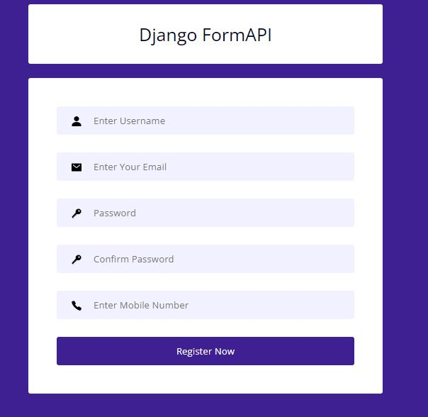

# [Live](https://ps0-dynamic-davy.circumeo-apps.net/)

# Django FormAPI Project

The Django FormAPI project is a simple registration form application that allows users to register with their name, email, password, and phone number. It includes validation for the input fields and displays appropriate error messages if the input does not meet the specified criteria.


## Features

- **Form Validation:** Ensures that the form inputs meet the specified criteria such as password strength, email uniqueness, and valid Pakistani mobile numbers.
- **Error Handling:** Displays relevant error messages if the input is invalid.
- **Messages:** Shows success messages upon successful registration.
- **Icons Integration:** Uses Ionicons for form input icons.


### Overview
- FormAPI



## Installation

1. **Clone the repository:**
    ```bash
    https://github.com/Sohail342/FormAPI-Django.git
    ```

2. **Create a virtual environment:**
    ```bash
    python3 -m venv env
    source env/bin/activate  # On Windows use `env\Scripts\activate`
    ```

3. **Install dependencies:**
    ```bash
    pip install -r requirements.txt
    ```

4. **Run migrations:**
    ```bash
    python manage.py migrate
    ```

5. **Create a superuser:**
    ```bash
    python manage.py createsuperuser
    ```

6. **Run the development server:**
    ```bash
    python manage.py runserver
    ```

7. **Access the application:**
    Open your browser and go to `http://127.0.0.1:8000`

## Usage

- **Register a new user:**
  - Fill in the required fields: name, email, password, confirm password, and phone number.
  - Click on "Register Now".
  - If the form is valid, a success message will be displayed, and the user will be saved in the database.
  - If the form is invalid, error messages will be displayed next to the respective fields.

## Form Validation Rules

- **Name:** Must be between 5 and 20 characters.
- **Email:** Must be a valid email address and not already registered.
- **Password:** 
  - Minimum 8 characters.
  - Must contain at least one uppercase letter, one lowercase letter, one numeric character, and one special character.
  - Must match the confirmation password.
- **Phone Number:** Must be a valid Pakistani mobile number (e.g., 03001234567 or +923001234567).


## Contact

If you have any questions or feedback, feel free to reach out:

<p align="left">
<a href="https://wa.me/+923428041928" target="blank"></a>
<a href="https://www.hackerrank.com/sohail_ahmad342" target="blank"></a>
<a href="https://www.linkedin.com/in/sohailahmad3428041928/" target="blank"></a>
<a href="https://instagram.com/sohail_ahmed113" target="blank"></a>
<a href="mailto:sohailahmed34280@gmail.com" target="blank"></a>
</p>
